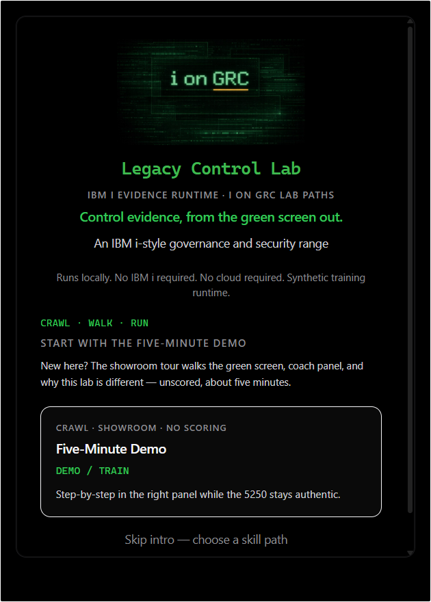
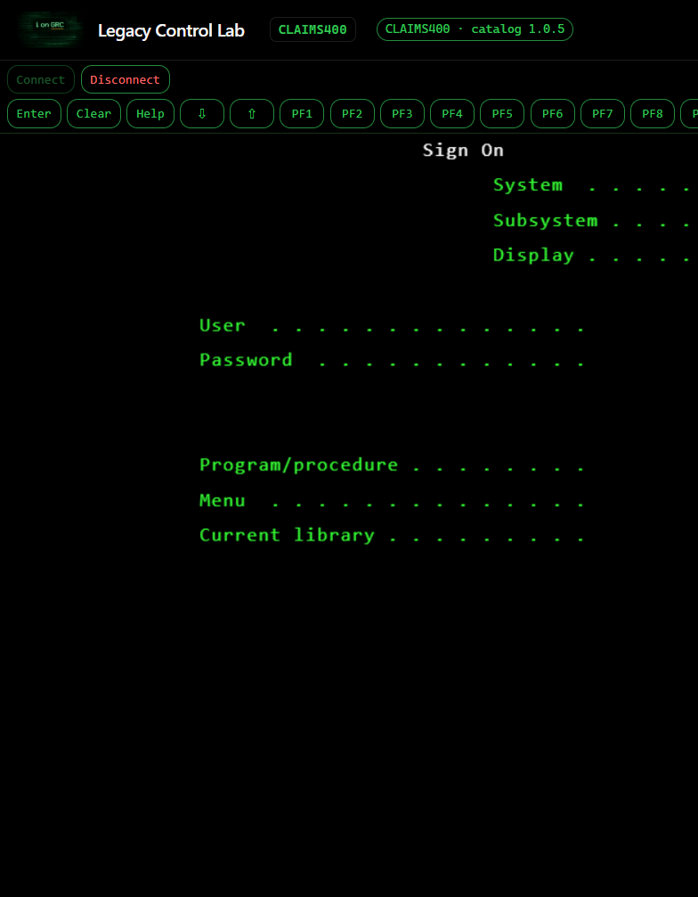
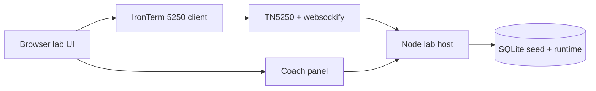

# Legacy Control Lab

**Control evidence, from the green screen out.**

Community Edition — a local **IBM i-style governance and security range** for learning how control evidence, privileged access, object authority, audit journals, job logs, spooled files, system values, and QSECOFR-like authority work in legacy environments.

Run it locally. **No IBM i required. No cloud required. No Node install required.**



## What you will experience in five minutes

1. Open the lab in your browser and pick **Five-Minute Demo**.
2. Sign on as `DEMO` / `TRAIN` on a green-screen terminal (5250-style).
3. Follow the coach panel: **why the step matters**, then the command to run.
4. Inspect synthetic profiles, authority, or journal-style evidence on `CLAIMS400`.
5. Capture a finding path and finish with `SUBMITMSN` — then try another lane.

You leave knowing what “control evidence from the green screen” feels like — not another dashboard screenshot tour.

| Lane | User | Password |
|------|------|----------|
| Five-Minute Demo | `DEMO` | `TRAIN` |
| i on GRC | `IONGRC` | `IONGRC` |
| Prove (auditor) | `AUDIT` | `TRAIN` |
| Operate privileged | `QSECOFR` | `TRAIN` |

These are public training passwords, not real credentials.



## Community Edition

This public repository is a **Docker-first runtime distribution**: enough to build and run all four lanes. It is not a dump of every internal authoring script, deep fidelity notebook, or marketing pack. See [docs/community-edition.md](docs/community-edition.md).

## Requirements

- **[Docker Desktop](https://www.docker.com/products/docker-desktop/)** (Windows or Mac)

Git is optional. The Download ZIP instructions below require only Docker Desktop.

### Windows Home or virtualization disabled

Docker Desktop can run this lab on **Windows 11 Home or Pro** by using the WSL 2 backend. Hyper-V is not required for the Linux containers used by Legacy Control Lab.

Before installing Docker Desktop:

1. Open **Task Manager → Performance → CPU** and check **Virtualization**.
2. If it says **Disabled**, restart the computer, enter its BIOS/UEFI setup, enable **Virtualization Technology**, **Intel VT-x**, **AMD-V**, or **SVM**, save, and restart. The name and menu location vary by manufacturer.
3. Open **PowerShell as Administrator** and run:

```powershell
wsl --install
```

4. Restart Windows when prompted.
5. Install Docker Desktop and use its **WSL 2 backend**.
6. Start Docker Desktop and wait for **Engine running** before continuing.

Microsoft: [Install WSL](https://learn.microsoft.com/windows/wsl/install) · Docker: [Install Docker Desktop on Windows](https://docs.docker.com/desktop/setup/install/windows-install/)

## Quick start — no Git required

1. Install and open **Docker Desktop**; wait for **Engine running**.
2. On this GitHub repository, select **Code → Download ZIP**.
3. Extract the downloaded ZIP completely. Do not run the lab from inside the ZIP preview.
4. Open the extracted `legacy-control-lab-main` folder in File Explorer.
5. Click the File Explorer address bar, type `powershell`, and press **Enter**.
6. Start the lab:

```powershell
docker compose up -d --build
```

The first build may take **3–5 minutes**. Then open **http://localhost:8080/lab/**.

### Keyboard and function keys

Legacy Control Lab uses IBM i-style function keys such as **F3**, **F4**, and **F12**. On some laptops, the physical function-key row controls volume, brightness, or other media features by default.

If a physical function key does not work, use the **virtual function-key buttons displayed in the terminal**. You do not need to change the laptop's keyboard or Fn-lock settings to complete the lab.

## Alternative — clone with Git

```powershell
git clone https://github.com/jtflack-grc/legacy-control-lab.git
cd legacy-control-lab
docker compose up -d --build
```

New to Docker? [docs/docker.md](docs/docker.md) · [docs/quickstart.md](docs/quickstart.md) · [SECURITY.md](SECURITY.md)

## Architecture (Community Edition)



Everything runs on your machine via Docker. Nothing is sent to a shared cloud demo.

## Crawl, walk, run

| Stage | What you pick | Sign-on |
|-------|---------------|---------|
| **Crawl** | Five-Minute Demo | `DEMO` / `TRAIN` |
| **Walk — Prove** | Governance, Blue Team, or Red Team | `AUDIT` / `TRAIN` or `APCLERK` / `TRAIN` |
| **Walk — Practice** | i on GRC articles | `IONGRC` / `IONGRC` |
| **Run** | Operate privileged | `QSECOFR` / `TRAIN` |

## Command honesty

Not every verb is “real IBM i CL at production depth.”

- **Stateful / deep** — synthetic mutation with journals, authorities, job logs
- **Display / representative** — credible inquiry screens and navigation
- **Lab-native** — training-only commands such as `WRKFINDING` and `SUBMITMSN` (not IBM CL)

Details: [docs/command-fidelity.md](docs/command-fidelity.md).

## Everyday commands

```powershell
docker compose up -d          # start
docker compose down           # stop (keeps progress)
docker compose down -v        # stop and erase lab data volume
docker compose logs --tail 100
```

## What this is not

- Not IBM i, DB2 for i, or an IBM product
- Not affiliated with IBM
- Not a production emulator or real service tools
- Not an exploit lab

## Ports

| Service | Port |
|---------|------|
| Lab UI | 8080 |
| websockify bridge | 6080 |
| TN5250 TCP host (internal) | 8023 |

## Version

**1.0.0** Community Edition — see [CHANGELOG.md](CHANGELOG.md).  
Public release ops: [docs/public-release-checklist.md](docs/public-release-checklist.md).

## License

See [LICENSE](LICENSE) (MIT). Browser terminal uses IronTerm (GPL-3.0) under `external/IronTerm-main/` — see [NOTICE](NOTICE) and [docs/licensing.md](docs/licensing.md).
