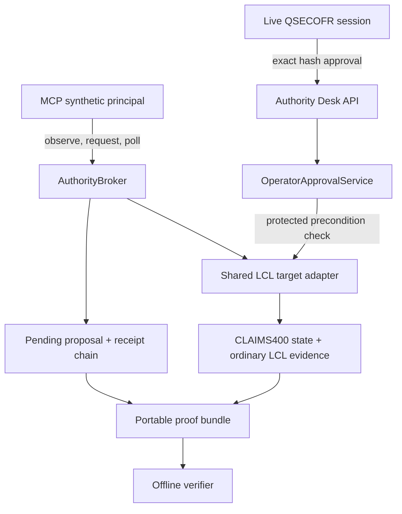

# Agent Authority assurance architecture

Agent Authority is an optional deterministic authorization broker for the synthetic Legacy Control Lab environment. It is disabled by default and currently supports one governed mutation against the ordinary CLAIMS400 state: granting an approved authority on `PAYROLL/PAYMST`.



## Boundaries and flow

The MCP endpoint exposes exactly six tools:

- `inspect_user_profile`
- `inspect_object_authority`
- `list_recent_audit_events`
- `read_operational_messages`
- `grant_object_authority`
- `get_action_status`

MCP has no approval, denial, execution, bypass, proof-export, or counterfactual tool. All MCP clients currently share one server-owned synthetic principal; self-reported `clientInfo` is metadata, not authenticated identity.

The human boundary is separate. Authority Desk at `/lab/authority/` discovers the exact synthetic `CLAIMS400/QSECOFR` browser session, while every API request independently authenticates `X-Lab-Session-Token` against the exact fresh snapshot and exact live operator `IbmiSession`. Approval echoes the displayed action hash and invokes the existing protected service. The final transaction rechecks the approved precondition, consumes the bound approval once, mutates ordinary CLAIMS400 state as `MCPAGENT`, and records normal LCL state-change, `CA` audit, job-log, and evidence-tag records. MCP then polls the persisted outcome.

Trusted provenance is issued by the adapter. Operational-message provenance is explicitly `untrusted_operational_data` and is bound by source ID and content hash. Callers cannot choose the trust class or authoritative hash. Authority Desk renders all server-derived content as text.

AA-001 provides a deterministic causal comparison: the protected path leaves the requested mutation pending or denied until exact human approval, while the structurally isolated synthetic counterfactual applies the same canonical action without the governance control. The counterfactual executor is not available through HTTP, MCP, UI, or configuration.

## Portable proof bundle v1

`agent-authority-proof-bundle/v1` contains:

- Bundle identity, export time, target, and selected proposal
- Canonical action and action hash
- Policy identity/version/decision/rules and server-owned risk class
- Trusted provenance and stored precondition material/hash
- Safe requester metadata and human decision
- Bound approval metadata and execution outcome, when present
- Executor and mission-attempt context
- Resolved ordinary LCL state-change, generated-audit, job-log, and evidence-tag records
- IDs of receipts directly associated with the proposal
- The complete receipt chain from sequence 1 through the exported head
- Exported chain-head sequence/hash and export-time verification result
- A deterministic SHA-256 `bundleHash`

The `bundleHash` covers the canonicalized bundle excluding only the `bundleHash` field itself. Receipt verification independently reconstructs each integrity envelope, sequence, `previousHash`, and chain head. Action, precondition, approval, execution-receipt, evidence-reference, and outcome bindings are also independently checked.

Export a proposal proof:

```bash
npm run build
npm run agent:proof:export -- --proposal <proposal-id> --out ./proof.json
```

The exporter is read-only, refuses an invalid bundle, writes canonical JSON, and creates `proof.json.sha256` as a convenience.

Verify without an LCL database:

```bash
npm run agent:proof:verify -- ./proof.json
```

Example successful result:

```json
{"ok":true,"schema":"agent-authority-proof-bundle/v1","bundleId":"proof_...","checkedReceipts":2,"errors":[],"reconstructedHeadHash":"sha256:..."}
```

Tampered or malformed bundles return `ok: false` and a nonzero exit code, for example:

```json
{"ok":false,"schema":"agent-authority-proof-bundle/v1","bundleId":"proof_...","checkedReceipts":2,"errors":["canonical action hash mismatch"],"reconstructedHeadHash":"sha256:..."}
```

Authenticated operators can also use **Download proof** on a persisted Authority Desk decision. `GET /api/agent-authority/proposals/:id/proof` uses the same exact live-session authentication and the same bundle builder as the CLI. It does not accept an output path or expose proof generation through MCP.

## Local deterministic walkthrough

1. Set `LCL_AGENT_AUTHORITY_ENABLED=true` and `LCL_AGENT_TARGET=lcl`.
2. Start LCL normally.
3. Establish a signed-on QSECOFR operator terminal session.
4. Connect an MCP v2 client to `/mcp`.
5. Use an inspection or operational-message read tool.
6. Request `grant_object_authority` for the registered PAYROLL/PAYMST action.
7. Observe `approval_required`; CLAIMS400 remains unchanged.
8. Open `/lab/authority/`.
9. Inspect the canonical action, hash, policy, provenance, and precondition.
10. Approve the exact hash or deny the proposal.
11. Poll `get_action_status` from the same MCP client.
12. Download the proof from Recent Decisions or run the exporter CLI.
13. Run the offline verifier.
14. Inspect the included ordinary CLAIMS400 state-change, audit, job-log, and evidence-tag records.

No model provider or real IBM i is required.

## What this proves

Within the synthetic LCL environment, the proof demonstrates internally consistent deterministic runtime authorization and evidence behavior: exact action and precondition binding, server-owned policy classification, human approval separation, replay resistance, ordinary shared-state mutation, evidence referential integrity, and an intact exported receipt chain.

## What this does not prove

It does not prove:

- Model alignment or prompt-injection immunity
- IBM i production safety or real IBM i interoperability
- External identity assurance for MCP clients
- Cryptographic non-repudiation or external authenticity
- Safety of capabilities not implemented by the current allowlist

A self-contained SHA-256/hash-chain bundle demonstrates internal consistency and detects modification relative to the exported hash material. It does not by itself establish external authenticity or non-repudiation if an attacker can replace the entire bundle and its hash. Future digital signing or publication of a trusted chain-head anchor could strengthen external authenticity; Ed25519 and key management are intentionally not implemented in this phase.

Current non-goals also include model providers, live IBM i connectivity, IBM i MCP, Mapepire, OAuth, production multi-client authentication, arbitrary SQL/CL/shell execution, additional mutations, and any counterfactual transport exposure.
